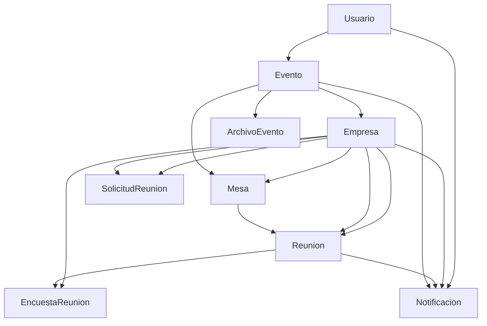

# Rueda de Negocios Beni (V1) - Backend

Backend del proyecto **Rueda de Negocios de Beni**, desarrollado en el marco de la materia **Proyecto de Sistemas 3** en la **Universidad Privada del Valle (UNIVALLE)**, en conjunto con la organizacion **UMA**.

## 👥 Integrantes del Equipo
- **Sebastián Erick Mendieta Jiménez**  
- **Manuel Dávil Monegro Vargas**  
- **Joshua Jair Chávez Abirai**  
- **Milton Rael Martínez del Castillo**  
- **Fabricio Camacho Blanco**  
- **Jairo Matías Guzmán Ramos**

## 🏗️ Arquitectura del Sistema

### Stack Tecnológico
- **Runtime**: Node.js con TypeScript
- **Framework**: Express.js
- **Base de Datos**: MongoDB con Mongoose ODM
- **Autenticación**: JWT (JSON Web Tokens)
- **Validación**: Zod
- **Almacenamiento**: Cloudinary
- **Testing**: Jest + Supertest
- **Monitoreo**: Prometheus (métricas)

### Características Principales
- ✅ API RESTful completa
- ✅ Autenticación y autorización JWT
- ✅ Validación robusta de datos
- ✅ Manejo de archivos con Cloudinary
- ✅ Sistema de notificaciones multi-canal
- ✅ Rate limiting y seguridad
- ✅ Logging y métricas
- ✅ Testing automatizado
- ✅ Sistema de seeding para datos de prueba

## 📊 Modelos de Datos

### 1. Usuario (`Usuario`)
**Propósito**: Gestiona los usuarios del sistema con diferentes roles.

**Campos**:
- `nombre` (string, requerido): Nombre del usuario
- `apellido` (string, requerido): Apellido del usuario  
- `email` (string, requerido, único): Email único del usuario
- `username` (string, requerido, único): Nombre de usuario único
- `passwordHash` (string, requerido): Hash de la contraseña
- `telefono` (string, opcional): Número telefónico
- `tipoUsuario` (enum): Rol del usuario (`'personal'`, `'dueño'`, `'admin'`)
- `creado_en` (Date): Timestamp de creación
- `actualizado_en` (Date): Timestamp de actualización

**Funcionalidades detrás**:
- Autenticación JWT con hash de contraseñas usando bcrypt
- Sistema de roles para control de acceso
- Validación de unicidad en email y username
- Middleware de autenticación para proteger rutas

### 2. Evento (`Evento`)
**Propósito**: Representa las ruedas de negocios organizadas.

**Campos**:
- `nombre` (string, requerido): Nombre del evento
- `descripcion` (string, requerido): Descripción detallada
- `inicio` (Date, requerido): Fecha y hora de inicio
- `fin` (Date, requerido): Fecha y hora de finalización
- `duracion_minutos_reunion` (number, requerido): Duración estándar de reuniones
- `numero_mesa` (number, opcional): Número de mesa asignada
- `modo_mesas` (enum): Modo de asignación (`'FIJA_POR_EMPRESA'`, `'POR_REUNION'`)
- `logo_url` (string, opcional): URL del logo del evento
- `creado_en` (Date): Timestamp de creación
- `actualizado_en` (Date): Timestamp de actualización

**Funcionalidades detrás**:
- Configuración flexible del sistema de mesas
- Gestión de duración de reuniones
- Vinculación con archivos del evento (mapas, cronogramas)

### 3. Empresa (`Empresa`)
**Propósito**: Representa las empresas participantes en los eventos.

**Campos**:
- `eventoId` (ObjectId, requerido): Referencia al evento
- `mesaId` (ObjectId, opcional): Referencia a la mesa asignada
- `nombre` (string, requerido): Razón social o nombre comercial
- `nit` (string, opcional): Número de identificación tributaria
- `rubro` (string, opcional): Sector o industria
- `representante` (string, opcional): Nombre del representante
- `telefono` (string, opcional): Teléfono de contacto
- `email` (string, opcional): Email de contacto
- `sitio_web` (string, opcional): Sitio web de la empresa
- `logo_url` (string, opcional): URL del logo de la empresa
- `descripcion` (string, opcional): Descripción de la empresa
- `creada_en` (Date): Timestamp de creación
- `actualizada_en` (Date): Timestamp de actualización

**Funcionalidades detrás**:
- Índice único por evento y nombre (evita duplicados)
- Asignación automática o manual de mesas
- Gestión de información completa de contacto
- Integración con sistema de archivos para logos

### 4. Mesa (`Mesa`)
**Propósito**: Representa las mesas de reunión disponibles en cada evento.

**Campos**:
- `eventoId` (ObjectId, requerido): Referencia al evento
- `numero` (number, requerido): Número visible de mesa
- `nombre` (string, opcional): Alias opcional de la mesa
- `ubicacion` (string, opcional): Ubicación física de la mesa
- `capacidad` (number, opcional): Número de asientos disponibles
- `activa` (boolean): Estado de disponibilidad
- `creado_en` (Date): Timestamp de creación
- `actualizado_en` (Date): Timestamp de actualización

**Funcionalidades detrás**:
- Índice único por evento y número (evita duplicados)
- Control de disponibilidad con campo `activa`
- Asignación automática basada en capacidad
- Integración con sistema de reuniones

### 5. Reunión (`Reunion`)
**Propósito**: Representa las reuniones programadas entre empresas.

**Campos**:
- `eventoId` (ObjectId, requerido): Referencia al evento
- `mesaId` (ObjectId, requerido): Referencia a la mesa
- `empresaAId` (ObjectId, requerido): Primera empresa participante
- `empresaBId` (ObjectId, requerido): Segunda empresa participante
- `inicio` (Date, requerido): Fecha y hora de inicio
- `fin` (Date, requerido): Fecha y hora de finalización
- `estado` (enum): Estado de la reunión (`'programada'`, `'confirmada'`, `'completada'`, `'cancelada'`, `'no_show'`)
- `notas` (string, opcional): Notas adicionales
- `creada_en` (Date): Timestamp de creación
- `actualizada_en` (Date): Timestamp de actualización

**Funcionalidades detrás**:
- Índice único compuesto para evitar duplicados
- Sistema de estados para seguimiento
- Validación de disponibilidad de mesa y horarios
- Generación automática de notificaciones
- Integración con sistema de encuestas

### 6. Solicitud de Reunión (`SolicitudReunion`)
**Propósito**: Gestiona las solicitudes de reunión entre empresas.

**Campos**:
- `eventoId` (ObjectId, requerido): Referencia al evento
- `empresaSolicitaId` (ObjectId, requerido): Empresa que solicita
- `empresaObjetivoId` (ObjectId, requerido): Empresa solicitada
- `mesaPreferidaId` (ObjectId, opcional): Mesa preferida
- `inicioPropuesto` (Date, opcional): Horario propuesto de inicio
- `finPropuesto` (Date, opcional): Horario propuesto de fin
- `mensaje` (string, opcional): Mensaje personalizado
- `estado` (enum): Estado de la solicitud (`'pendiente'`, `'aceptada'`, `'rechazada'`, `'cancelada'`)
- `creada_en` (Date): Timestamp de creación
- `actualizada_en` (Date): Timestamp de actualización

**Funcionalidades detrás**:
- Índice único parcial para evitar solicitudes duplicadas pendientes
- Sistema de notificaciones automáticas
- Flujo de aprobación/rechazo
- Generación automática de reuniones al aceptar
- Integración con sistema de mensajería

### 7. Encuesta de Reunión (`EncuestaReunion`)
**Propósito**: Recopila feedback sobre las reuniones realizadas.

**Campos**:
- `eventoId` (ObjectId, requerido): Referencia al evento
- `reunionId` (ObjectId, requerido): Referencia a la reunión
- `empresaId` (ObjectId, requerido): Empresa que responde
- `calificacion_general` (number, 1-5): Calificación general
- `match_negocio` (number, 1-5, opcional): Match de negocio
- `puntualidad` (number, 1-5, opcional): Evaluación de puntualidad
- `interes_contraparte` (number, 1-5, opcional): Interés en contraparte
- `recomendar_nps` (number, 0-10, opcional): Puntuación NPS
- `comentarios` (string, opcional): Comentarios adicionales
- `creada_en` (Date): Timestamp de creación
- `actualizada_en` (Date): Timestamp de actualización

**Funcionalidades detrás**:
- Índice único por reunión y empresa (una respuesta por empresa)
- Sistema de métricas NPS
- Análisis de satisfacción
- Reportes automáticos de feedback

### 8. Notificación (`Notificacion`)
**Propósito**: Sistema de notificaciones multi-canal del sistema.

**Campos**:
- `eventoId` (ObjectId, opcional): Referencia al evento
- `reunionId` (ObjectId, opcional): Referencia a la reunión
- `empresaId` (ObjectId, opcional): Referencia a la empresa
- `usuarioId` (ObjectId, opcional): Referencia al usuario
- `tipo` (string, requerido): Tipo de notificación
- `canal` (enum): Canal de envío (`'app'`, `'email'`, `'sms'`, `'whatsapp'`)
- `titulo` (string, requerido): Título de la notificación
- `mensaje` (string, requerido): Contenido del mensaje
- `payload` (object, opcional): Datos adicionales
- `estado` (enum): Estado (`'pendiente'`, `'enviada'`, `'leida'`, `'fallida'`)
- `intento` (number, opcional): Número de intentos de envío
- `creada_en` (Date): Timestamp de creación
- `actualizada_en` (Date): Timestamp de actualización

**Funcionalidades detrás**:
- Sistema multi-canal (app, email, SMS, WhatsApp)
- Cola de notificaciones con reintentos
- Seguimiento de estado de entrega
- Contexto completo de la notificación
- Integración con servicios externos

### 9. Archivo de Evento (`ArchivoEvento`)
**Propósito**: Gestiona archivos relacionados con eventos (mapas, cronogramas, etc.).

**Campos**:
- `eventoId` (ObjectId, requerido): Referencia al evento
- `tipo` (enum): Tipo de archivo (`'MAPA'`, `'CRONOGRAMA'`, `'OTRO'`)
- `url` (string, requerido): URL del archivo almacenado
- `nombre_archivo` (string, requerido): Nombre original del archivo
- `mime` (string, requerido): Tipo MIME del archivo
- `creado_en` (Date): Timestamp de creación

**Funcionalidades detrás**:
- Integración con Cloudinary para almacenamiento
- Categorización por tipo de archivo
- Validación de tipos MIME
- URLs seguras y optimizadas
- Gestión de metadatos de archivos

## 🔗 Relaciones Entre Modelos



## 🛠️ API Endpoints

### Autenticación (`/api/auth`)
- `POST /login` - Iniciar sesión
- `POST /register` - Registro de usuario
- `POST /refresh` - Renovar token
- `POST /logout` - Cerrar sesión

### Usuarios (`/api/usuarios`)
- `GET /` - Listar usuarios
- `GET /:id` - Obtener usuario
- `PUT /:id` - Actualizar usuario
- `DELETE /:id` - Eliminar usuario

### Eventos (`/api/eventos`)
- `GET /` - Listar eventos
- `POST /` - Crear evento
- `GET /:id` - Obtener evento
- `PUT /:id` - Actualizar evento
- `DELETE /:id` - Eliminar evento

### Empresas (`/api/empresas`)
- `GET /` - Listar empresas
- `POST /` - Crear empresa
- `GET /:id` - Obtener empresa
- `PUT /:id` - Actualizar empresa
- `DELETE /:id` - Eliminar empresa
- `GET /evento/:eventoId` - Empresas por evento

### Mesas (`/api/mesas`)
- `GET /` - Listar mesas
- `POST /` - Crear mesa
- `GET /:id` - Obtener mesa
- `PUT /:id` - Actualizar mesa
- `DELETE /:id` - Eliminar mesa
- `GET /evento/:eventoId` - Mesas por evento

### Reuniones (`/api/reuniones`)
- `GET /` - Listar reuniones
- `POST /` - Crear reunión
- `GET /:id` - Obtener reunión
- `PUT /:id` - Actualizar reunión
- `DELETE /:id` - Eliminar reunión
- `GET /evento/:eventoId` - Reuniones por evento

### Solicitudes (`/api/solicitudes`)
- `GET /` - Listar solicitudes
- `POST /` - Crear solicitud
- `GET /:id` - Obtener solicitud
- `PUT /:id` - Actualizar solicitud
- `DELETE /:id` - Eliminar solicitud
- `PUT /:id/aceptar` - Aceptar solicitud
- `PUT /:id/rechazar` - Rechazar solicitud

### Encuestas (`/api/encuestas`)
- `GET /` - Listar encuestas
- `POST /` - Crear encuesta
- `GET /:id` - Obtener encuesta
- `PUT /:id` - Actualizar encuesta
- `DELETE /:id` - Eliminar encuesta

### Notificaciones (`/api/notificaciones`)
- `GET /` - Listar notificaciones
- `POST /` - Crear notificación
- `GET /:id` - Obtener notificación
- `PUT /:id` - Actualizar notificación
- `DELETE /:id` - Eliminar notificación
- `PUT /:id/marcar-leida` - Marcar como leída

### Archivos (`/api/archivos-evento`)
- `GET /` - Listar archivos
- `POST /` - Subir archivo
- `GET /:id` - Obtener archivo
- `DELETE /:id` - Eliminar archivo
- `GET /evento/:eventoId` - Archivos por evento

### Storage (`/api/storage`)
- `POST /upload` - Subir archivo
- `DELETE /:filename` - Eliminar archivo

## 🚀 Instalación y Configuración

### Prerrequisitos
- Node.js (v18 o superior)
- MongoDB (v5 o superior)
- Cuenta en Cloudinary (para almacenamiento de archivos)

### Variables de Entorno
Crear archivo `.env` con las siguientes variables:

```env
# Base de datos
MONGODB_URI=mongodb://localhost:27017/rueda-negocios

# Autenticación
JWT_SECRET=tu-jwt-secret-super-seguro
JWT_EXPIRES_IN=7d

# Cloudinary
CLOUDINARY_CLOUD_NAME=tu-cloud-name
CLOUDINARY_API_KEY=tu-api-key
CLOUDINARY_API_SECRET=tu-api-secret

# Servidor
PORT=3000
NODE_ENV=development

# Rate Limiting
RATE_LIMIT_WINDOW_MS=900000
RATE_LIMIT_MAX_REQUESTS=100
```

### Instalación
```bash
# Clonar repositorio
git clone [url-del-repositorio]
cd RuedaNegociosBeni_V1_Backend

# Instalar dependencias
npm install

# Configurar variables de entorno
cp .env.example .env
# Editar .env con tus configuraciones

# Ejecutar seeds para datos de prueba
npm run seed

# Iniciar servidor de desarrollo
npm run dev
```

### Scripts Disponibles
```bash
# Desarrollo
npm run dev          # Servidor de desarrollo con hot reload
npm run build        # Compilar TypeScript
npm run start        # Ejecutar versión compilada

# Testing
npm test             # Ejecutar todos los tests
npm run test:watch   # Tests en modo watch

# Seeds (Datos de prueba)
npm run seed         # Ejecutar todos los seeds
npm run seed:usuarios    # Solo usuarios
npm run seed:eventos     # Solo eventos
npm run seed:empresas    # Solo empresas
npm run seed:mesas       # Solo mesas
npm run seed:reuniones   # Solo reuniones
npm run seed:solicitudes # Solo solicitudes
npm run seed:encuestas   # Solo encuestas
npm run seed:notificaciones # Solo notificaciones
npm run seed:archivos   # Solo archivos
```

## 🔒 Seguridad y Middleware

### Middleware Implementado
- **Helmet**: Headers de seguridad HTTP
- **CORS**: Configuración de Cross-Origin Resource Sharing
- **Rate Limiting**: Limitación de requests por IP
- **JWT Authentication**: Autenticación basada en tokens
- **Input Validation**: Validación con Zod
- **Error Handling**: Manejo centralizado de errores
- **Request Logging**: Logging con Morgan
- **Metrics**: Métricas con Prometheus

### Autenticación y Autorización
- Tokens JWT con expiración configurable
- Hash de contraseñas con bcrypt
- Middleware de autenticación para rutas protegidas
- Sistema de roles (personal, dueño, admin)
- Refresh tokens para renovación automática

## 📊 Monitoreo y Métricas

### Endpoints de Monitoreo
- `GET /health` - Estado de salud del servidor
- `GET /metrics` - Métricas de Prometheus
- `GET /api` - Información de la API

### Métricas Incluidas
- Requests HTTP por endpoint
- Tiempo de respuesta
- Errores por endpoint
- Uso de memoria
- Conexiones a base de datos

## 🧪 Testing

### Estructura de Tests
- **E2E Tests**: Tests de extremo a extremo para cada endpoint
- **Unit Tests**: Tests unitarios para funciones específicas
- **Integration Tests**: Tests de integración entre componentes

### Ejecutar Tests
```bash
# Todos los tests
npm test

# Tests específicos
npm test -- --testNamePattern="usuarios"

# Tests con cobertura
npm test -- --coverage

# Tests en modo watch
npm test -- --watch
```

## 📁 Estructura del Proyecto

```
src/
├── app.ts                 # Configuración principal de Express
├── server.ts             # Punto de entrada del servidor
├── config/               # Configuraciones
│   ├── cloudinary.ts     # Configuración de Cloudinary
│   ├── cors.ts          # Configuración de CORS
│   ├── db.ts            # Conexión a MongoDB
│   ├── env.ts           # Variables de entorno
│   └── metrics.ts       # Configuración de métricas
├── controllers/         # Controladores de la API
├── middleware/          # Middleware personalizado
├── models/             # Modelos de Mongoose
├── routes/             # Definición de rutas
├── seeds/              # Scripts de seeding
├── services/           # Lógica de negocio
└── tests/              # Tests automatizados
```

## 🔄 Flujo de Trabajo

### Flujo de Reuniones
1. **Creación de Evento**: Admin crea evento con configuración
2. **Registro de Empresas**: Empresas se registran al evento
3. **Asignación de Mesas**: Sistema asigna o permite selección de mesas
4. **Solicitudes**: Empresas solicitan reuniones con otras
5. **Aprobación**: Empresas aceptan/rechazan solicitudes
6. **Programación**: Reuniones se programan automáticamente
7. **Ejecución**: Reuniones se realizan en horarios asignados
8. **Feedback**: Encuestas post-reunión recopilan feedback
9. **Notificaciones**: Sistema notifica cambios de estado

### Flujo de Notificaciones
1. **Trigger**: Evento del sistema genera notificación
2. **Creación**: Se crea registro en base de datos
3. **Cola**: Notificación se agrega a cola de envío
4. **Procesamiento**: Servicio procesa y envía notificación
5. **Seguimiento**: Se actualiza estado de entrega
6. **Reintentos**: Fallos se reintentan automáticamente

## 🎯 Funcionalidades Clave

### Sistema de Mesas Inteligente
- Asignación automática basada en preferencias
- Control de disponibilidad en tiempo real
- Gestión de conflictos de horarios
- Optimización de uso de espacio

### Gestión de Reuniones
- Programación automática con validaciones
- Control de estados completo
- Manejo de cancelaciones y cambios
- Integración con sistema de notificaciones

### Sistema de Feedback
- Encuestas personalizables
- Métricas NPS integradas
- Análisis de satisfacción
- Reportes automáticos

### Notificaciones Multi-canal
- Soporte para múltiples canales
- Cola de notificaciones con reintentos
- Seguimiento de entrega
- Templates personalizables

## 📈 Próximas Mejoras

- [ ] Dashboard de administración
- [ ] API de reportes avanzados
- [ ] Integración con calendarios externos
- [ ] Sistema de badges/insignias
- [ ] Chat en tiempo real
- [ ] Exportación de datos
- [ ] API de estadísticas en tiempo real
- [ ] Sistema de backup automático
